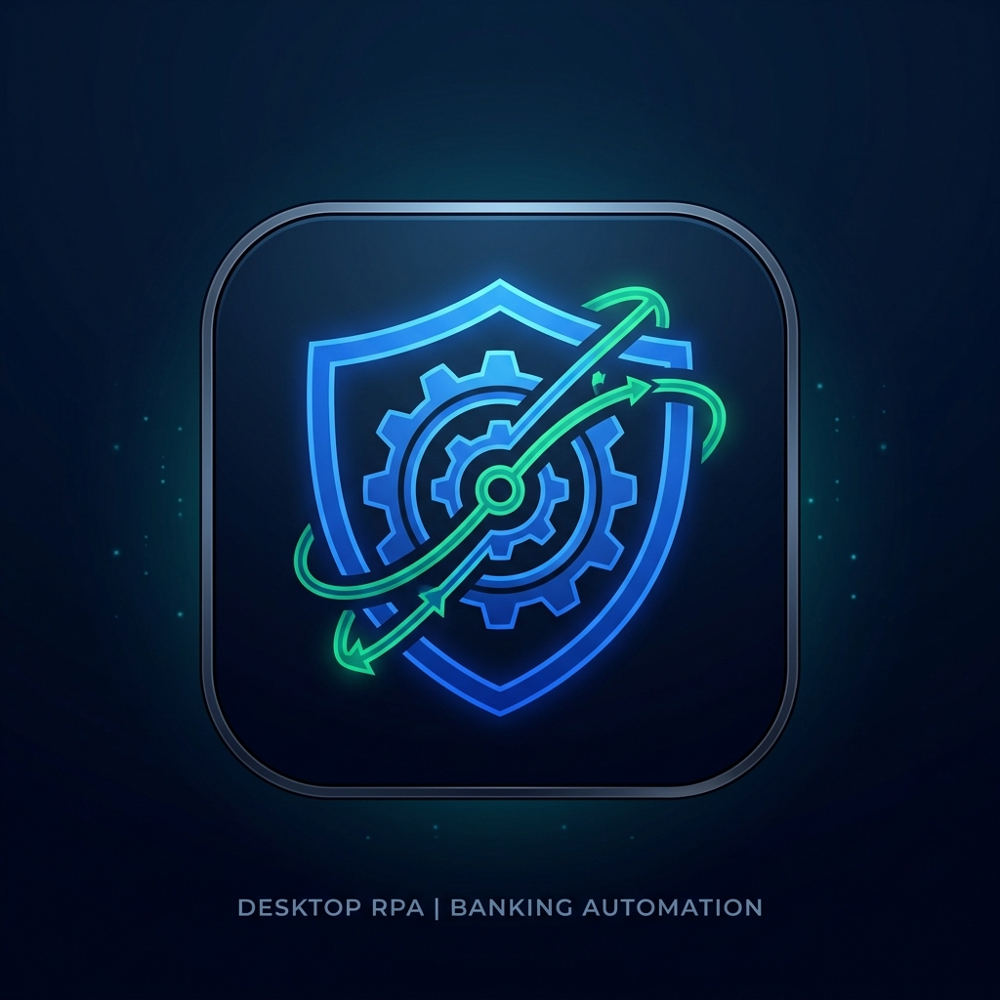
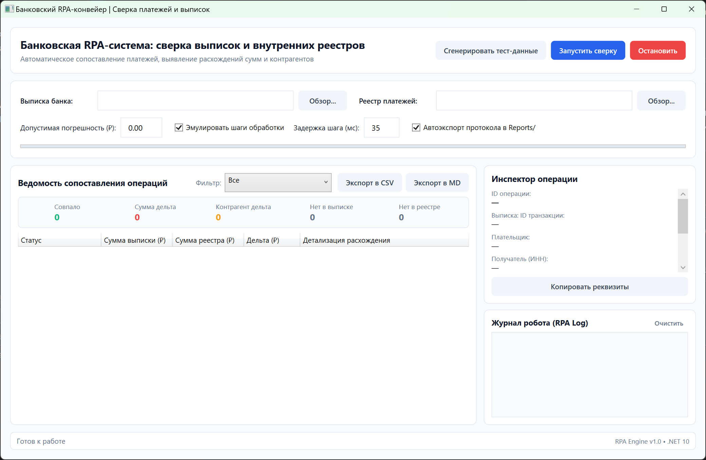

<p align="center">
  
</p>

<h1 align="center">BankReconcile RPA</h1>

<p align="center">
  <b>Промышленная Desktop RPA-система автоматизации сверки межбанковских платежей и внутренних реестров АБС</b>
</p>

<p align="center">
  
  
  
  
  
  
</p>

---

## 📸 Скриншот интерфейса

Наглядный рабочий интерфейс системы автоматизированной сверки с визуализацией расхождений, карточками метрик, инспектором транзакций и логом робота:

<p align="center">
  
</p>

---

## 📌 О проекте

**BankReconcile RPA** — решение, разработанное для полной замены монотонных офисных операций банковского специалиста расчетно-кассового центра (РКЦ) и операционного департамента. 

Приложение устраняет человеческий фактор при сопоставлении сотен межбанковских платежей, на лету выявляет дельты сумм, ошибки в ИНН контрагентов и транзакции, «зависшие» только на одной стороне (в выписке банка или во внутреннем реестре АБС).

### Ключевые возможности

- ⚡ **Двусторонний парсинг**: скоростная обработка файлов банковских выписок и реестров платежей АБС.
- 🎯 **Интеллектуальный матчинг**: сопоставление по референсам документов (`ReferenceNumber`), номерам платежей и ИНН контрагентов.
- 🔍 **Многофакторная классификация инцидентов**:
  - `Matched` — полное соответствие суммы и реквизитов.
  - `AmountMismatch` — сумма операции не сходится с расчетной (расчет дельты).
  - `CounterpartyMismatch` — несовпадение ИНН/наименования получателя.
  - `MissingInBankStatement` — платеж есть в реестре, но не прошел по выписке.
  - `MissingInInternalRegistry` — списание прошло по банку, но отсутствует в учетной системе.
- ⏱ **Режим эмуляции**: настраиваемая визуализация выполнения шагов RPA-робота в интерфейсе в реальном времени.
- 📊 **Автоматическое протоколирование**: мгновенный экспорт сводной ведомости в форматы **CSV** и **Markdown**.
- 🧪 **Встроенный генератор данных**: возможность в один клик сгенерировать комплект данных с типовыми инцидентами для тестирования и обучения персонала.

---

## 🏛 Архитектура решения

Решение спроектировано по принципам **Clean Architecture** и **MVVM**:

```
DesktopRpaAutomation/
│
├── .github/                       # GitHub Actions CI пайплайн
├── docs/assets/                   # Логотип и скриншоты интерфейса
│   ├── logo.png
│   └── app_main_screenshot.png
│
├── src/
│   ├── DesktopRpa.Core/           # Ядро доменной логики (чистый .NET 10)
│   │   ├── Models/                # Доменные сущности (BankTransaction, RegistryPayment, ReconciliationReport...)
│   │   └── Services/              # Сервисы парсинга, движок сверки, экспорт отчетов, генератор данных
│   │
│   └── DesktopRpa.App/            # Презентационный слой (WPF, MVVM, DI)
│       ├── Converters/            # XAML-конвертеры статусов и цветов
│       ├── Services/              # UI-абстракции (диалоги, буфер обмена)
│       ├── ViewModels/            # MainViewModel на CommunityToolkit.Mvvm
│       ├── Views/                 # MainWindow XAML интерфейс
│       ├── App.xaml               # Палитра тем, стили кнопок и инпутов
│       └── App.xaml.cs            # Точка входа, настройка Microsoft.Extensions.DependencyInjection
│
└── tests/
    └── DesktopRpa.Tests/          # Набор модульных и интеграционных тестов (xUnit)
```

---

## 🛠 Технологический стек

| Компонент | Технология | Назначение |
|---|---|---|
| **Platform** | .NET 10.0 (C# 14) | Базовая платформа с оптимизированным JIT и GC |
| **GUI Framework** | Windows Presentation Foundation (WPF) | Аппаратно-ускоренный декларативный интерфейс Windows |
| **MVVM Toolkit** | CommunityToolkit.Mvvm (v8.4.2) | Source-генераторы свойств и команд, слабая связанность |
| **DI Container** | Microsoft.Extensions.DependencyInjection | Инверсия управления и управление жизненным циклом сервисов |
| **Testing** | xUnit, Microsoft.NET.Test.Sdk | Юнит-тесты ядра и интеграционные тесты RPA-пайплайна |

---

## 🚀 Быстрый старт

### Системные требования
- ОС: Windows 10 / 11 (x64)
- Установленный [.NET SDK 10.0+](https://dotnet.microsoft.com/download)

### 1. Клонирование репозитория
```bash
git clone https://github.com/mensferrea/DesktopRpaAutomation.git
cd DesktopRpaAutomation
```

### 2. Сборка решения
```bash
dotnet build DesktopRpaAutomation.sln
```

### 3. Запуск тестов
```bash
dotnet test
```

### 4. Запуск приложения
```bash
dotnet run --project src/DesktopRpa.App/DesktopRpa.App.csproj
```

---

## 📋 Пошаговый сценарий работы

1. **Запуск**: Откройте настольное приложение.
2. **Получение данных**: Нажмите **«Сгенерировать тест-данные»** (либо выберите рабочие файлы через **«Обзор...»**).
3. **Параметры**:
   - Укажите допустимую дельту (по умолчанию `0.00` ₽).
   - При необходимости включите эмуляцию шагов с задержкой (например, `35` мс).
4. **Старт**: Нажмите **«Запустить сверку»**.
5. **Анализ**:
   - Просмотрите общую статистику на карточках вверху.
   - Фильтруйте ведомость (например, только расхождения по суммам или ИНН).
   - Выберите любую строку, чтобы изучить подробности в панели **«Инспектор операции»**.
   - Нажмите **«Копировать реквизиты»** для переноса данных инцидента.
6. **Выгрузка**: Воспользуйтесь кнопками **«Экспорт в CSV»** или **«Экспорт в MD»** для сохранения отчета по аудиту.

---

## 📄 Лицензия

Проект распространяется под открытой лицензией [MIT](LICENSE).
